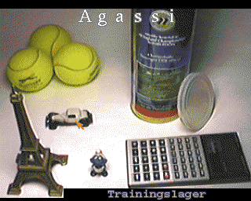
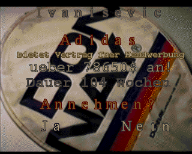
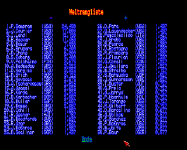

Manage a [tennis](https://en.wikipedia.org/wiki/Tennis) player and guide him through his career by taking care of his finances, training & skill development, and participation in [tournaments](https://en.wikipedia.org/wiki/List_of_tennis_tournaments). Up to *four managers* can take part in this [hotseat](https://en.wikipedia.org/wiki/Hotseat_(multiplayer_mode)) game.

The simulation is composed of the a few key elements. The [gallery](README.md#gallery) illustrates some of them:

* **Tennis Players**
	* The top *140* players of *1994* are in the game. The *1* to *4* managed players start young and with low skills. The rest of the players have differing realistic skills that remain stable throughout the game.
	* *Skills:* There are several *categories* that contribute to a different degree for the calculation of *aggregate skills* on *court types*. For example, *baseline shots* are fundamental for *clay* courts, whereas *volleys* are important for *grass* or *carpet* courts.
	* *Special Skills:* The player's *experience* only improves by active participation in tournaments. The weight of *endurance* increases steadily throughout a match. *Health* deteriorates by participating in tournaments and training camps.
	* *Progression:* Player *age* leads to a continuous improval (young age) or deterioration (old age) of skills. In addition, *training camps* are available for skill *boosts*. There, the manager chooses the skill categories to focus on. The more expensive the camp the more boosts are provided.
* **Manager Finances**
	* *Start capital:* Depending on the *difficulty level*, it ranges from *10,000* to *1,000,000*. Whereas a *beginner* may become competitive within few weeks by repetitively booking training camps, an *expert* must wait years for the natural progression to take place.
	* *Sponsoring:* One contract can be signed for the *shirt* and the *sleeve* respectively. The money offered by the sponsor depends on the player skills and ranking. Installments are paid out on a weekly basis.
* **Tournaments**
	* *Schedule:* The tournaments of *1994* are available in the game. Their prize money, calendar week, court type, and number of sets are all realistic for that time.
	* *Prize Money:* Is divided among the participants based on performance, meaning that the winner gets much more than losers of the first round. No money is given to players who fail in the qualification.
	* *Participation:* Each manager may choose to let his player participate if his health is good enough and he is not on a training camp. In addition, travel expenses (*1,000* to *3,000*) must be paid. The AI players take part based on their skill for the tournament court type and the prize money.
	* *Points for Ranking:* The rules of *1994* are applied. This means that bigger tournaments provide more points. In addition, awarded points expire after exactly one year.

# How to Use

Put the repository into a mounted directory of an *emulated* [Amiga 500](https://en.wikipedia.org/wiki/Amiga_500) and run the script from the shell:
```
execute TennisManager
```

You can also start using the workbench (`info`-files provided).

The game language is *German* - but you only need to know some key words in order to play it.

The game is completely written in [AmigaBASIC](https://en.wikipedia.org/wiki/Amiga_Basic). Its source code (both [ASCII](https://en.wikipedia.org/wiki/ASCII) and [tokenized](https://en.wikipedia.org/wiki/Lexical_analysis#Tokenization)) is also provided and can be run from the [IDE](https://en.wikipedia.org/wiki/Integrated_development_environment). The point of entry is `src-tokenized/Tennis`, but be sure to reside in the `src-tokenized` directory.

# Trivia

* *Assembly subroutines:* The game is significantly sped up by using dedicated [Assembly](https://en.wikipedia.org/wiki/Assembly_language) subroutines. Their sources are found [here](https://github.com/phoyh/misc-asm-68k-amiga-ocs).
* *Split program:* AmigaBASIC has a limit on the program size. It can only be raised by some degree using `CLEAR`. Hence, the program is split into several parts:
	* [`Tennis`](src/Tennis): Entry point including the `CLEAR`.
	* [`Tennis0`](src/Tennis0): Simulation data and game setup.
	* [`Tennis2`](src/Tennis2): Weekly managerial routine. This is the largest part.
	* [`Tennis3`](src/Tennis3): Tournament competition, including match observation and the country flags.
	* [`Tennis4`](src/Tennis4): Save & load routines.
	* [`Tennis5`](src/Tennis5): National anthems - implemented natively in AmigaBASIC based on the `SOUND` statement.
	* [`Tennis6`](src/Tennis6): Newspaper reports.
	* [`Tennis8`](src/Tennis8): ATP ranking.
* *Diskfont library:* The only [OS](https://en.wikipedia.org/wiki/Operating_system) routine for which relative paths do not work. Hence, it is put into the `src` folders.
* *Anachronisms:* The [Soviet Union](https://en.wikipedia.org/wiki/Soviet_Union) appears as country although, by 1994, it was already dissolved.

# Gallery

## Setup

|  |  |
| :--: | :--: |
| Load a game state or start afresh | Up to 4 hotseat managers can participate |

|  |
| :--: |
| Each manager has a name and (inconsequential) birthday.<br>The difficulty level mainly determines player money at start.<br>Press return for confirming the name and click the top bar for completing manager entry. |

|  |  |
| :--: | :--: |
| Each manager chooses the tennis player <br> he wants to manage. The chosen player's <br> skill is set to the same level irrespective <br> of who is chosen. | The player's birthday serves the purpose <br> of keeping track of the season.<br>*Note that the manager's and <br> player's birthdays conincide...* |

## Weekly Management Routines

|  |  |
| :--: | :--: |
| Game menu for viewing player skill,<br>consulting tournament schedules,<br>and booking training camps. | Player skill has several categories.<br>The aggregate skill level by court type is based<br>on realistic weights of these categories. |

|  |
| :--: |
| In training camps, the player's skill categories are selectively boosted (by *4%-10%*).<br>The more expensive that the camp, the more boosts are available.<br>*Note that none of the medieval buildings seem to have been preserved to modern times.* |

|  |  |
| :--: | :--: |
| Main menu for finances, player skill, <br> time series and save files. | Game menu for viewing cash flow<br>and obtaining sponsoring contracts. |

|  |  |
| :--: | :--: |
| You may hold up to one sponsoring contract<br>on the shirt and sleeve respectively. | Offer for a new sponsoring contract, <br> it is paid out weekly. |

|  |  |
| :--: | :--: |
| Game menu for saving, loading,<br>and deleting game states. | Click on *"New Name"* to create new save<br>or click on the left to overwrite. |

## Tournaments

|  |
| :--: |
| The tournament schedule for the first few weeks of the year. <br> Each tournament differs in its prize money and the court type. |

|  |  |
| :--: | :--: |
| If no managed player participates, you<br>can choose to skip observing it. | Only high-level information of tournament<br>status is displayed if participation skipped. |

|  |  |
| :--: | :--: |
| The tournament's draw for the qualification<br>round, the player is highlighted. | The player competes live, game-by-game,<br>against another contestant.<br>The **A** denotes the player who serves. |

## Results

|  |  |
| :--: | :--: |
| After the tournament, the new ATP rankings<br>are calculated. *The speed-up <br> of doing that in Assembly is 100x.* | The points of the ATP rankings adhere<br>to the rules of *1994*. |

|  |
| :--: |
| Newspaper commentary on the player's performance in the last tournament.<br>Available whenever player passes the qualification. |

|  |
| :--: |
| Newspaper overview on the tournament's outcome.<br>The performance of each seeded participant is listed.<br>*And the national anthem of the winner is played.* |

## Statistics

|  |  |
| :--: | :--: |
| Time series for player's money. <br> He has more expenses than income. | Time series for player's rank. <br> The breakthrough is still outstanding. |

|  |
| :--: |
| Time series for player's skill level by court type - he has improved a lot in a few weeks. |
